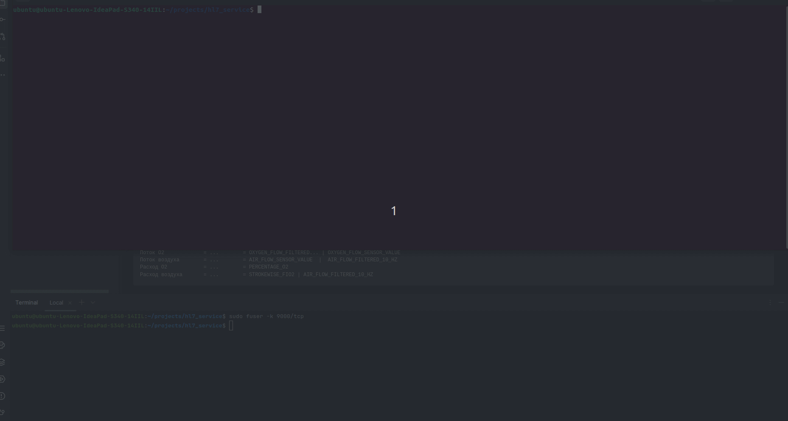

# HL7 service

Сервис позволяет запускать `TCPHL7-сервер`, который формирует фиктивные `HL7` сообщения типа `ACK`.
Сервис так же позволяет запускать `TCPHL7-клиент`'а, который подключается к серверу и получает `HL7` сообщения.
Вывод сообщений можно увидеть из браузера, если будет выставлен флаг `SHOW_RESULT_TO_BROWSER` в `True`.



__Принцип работы:__

1. Первое, нужно запустить `TCPHL7-сервер`: *в этом случае каждый интервал времени `TIME_REPEAT_SENDING` (секунд) будут формироваться данные со случайными значениями `TCPHL7-сервера`. `TCPHL7-сервер` сериализует эти данные в `HL7` сообения.*
2. Второе, нужно запустить `TCPHL7-клиент`: *в этом случае будут получены данные из `TCPHL7-сервер`*
3. Вывод результата в реальном времени.


__Информация о фиктивных данных:__
```
Дыхательный объем    = Vt         = TIDAL_VOLUME
Минутный объем       = Volume     = MINUTE_VOLUME
PEEP                 = PEEP       = POSITIVE_END_EXPIRATORY_PRESSURE_0409
Pmean                = Pmean      = MEAN_PRESSURE
Pplat                = Pplat      = PLATEAU_PRESSURE
Ppeak                = Ppeak      = PEAK_INSPIRATORY_PRESSURE  # old value - PATIENT_VOLUME
Отношение вдох:выдох = Tinsp|Texp = INSPIRATORY_TIME|EXPIRATORY_TIME
Compliance           = CDyn       = NoTag.CDyn       # old: PPS_COMPLIANCE
FiO2 (%)             = FiO2 (%)   = REAL_TIME_FIO2_FILTERED_2_HZ
ЧД общая             = RRtotal    = RESPIRATORY_RATE_TOTAL
ЧД мех               = RRmand     =  RESPIRATORY_RATE_MANDATORY
ЧД спонтанная        = RRspon     = RESPIRATORY_RATE_SPONTANEOUS
etCO2 (мм рт ст)     = EtCO2      = END_TIDAL_CO2 # Capnograph
Поток О2             = ...        = OXYGEN_FLOW_FILTERED... | OXYGEN_FLOW_SENSOR_VALUE  
Поток воздуха        = ...        = AIR_FLOW_SENSOR_VALUE  |  AIR_FLOW_FILTERED_10_HZ 
Расход O2            = ...        = PERCENTAGE_O2
Расход воздуха       = ...        = STROKEWISE_FIO2 | AIR_FLOW_FILTERED_10_HZ
```


__Пример HL7 сообщения используя эти данные:__
```
MSH|^~\&|||||20240321172826||U09|888|T|2.5||||AL
MSA|AA|Texp:0,EtCO2:0.99,Pplat:61,Pmean:54,Volume:2,Vt:0.8,RRmand:108,f:72,FiO2:96,RRspon:133,PEEP:62,PPS.C:61.9,FIO2:46,Ppeak:33,Tinsp:0.0
```


## Быстрый старт

1. В первой консоли ввести `make run_server`
2. Во второй консоли ввести `make run_client`
3. Вы должны получать `HL7` сообщения в реальном времени.


## Установка

При первоначальном запуске установка будет произведена  автоматически.
Будет создано виртуальное окружение `venv` и установлены необходимые пакеты для работы `TCPHL7-сервер`а и `TCPHL7-клиент`а.


## Запуск

### Запуск TCPHL7-сервера

Сервер нужно запустить в 1ю очередь, иначе клиент не сможет получать данные. 
Будет активировано виртуальное окружение `venv`. 
В консоли отобразиться справочная информация о IP адрессах и способах подключений к `TCPHL7-сервер`'у для получения `HL7` сообщений.

```sh
make run_server
```


### Запуск TCPHL7-клиента
Будет активировано виртуальное окружение `venv`. В консоли начнут отображаться `HL7` сообщения в реальном времени.
Можно использовать `telnet` или `браузер` как альтернативный способ получения информации (альтернативный клиент).
```sh
make run_client
```


### Запуск всех служб одновременно (альтернативный запуск)

__Не рекомендуется!__ Можно запустить сразу весь `HL7_service` сервис полностью.
В этом случае `TCPHL7-сервер` и `TCPHL7-клиент` будут запущенны одновременно. Активируется виртуальное окружение `venv`. 
В консоли будут отображаться только данные `TCPHL7-сервер`а. Чтобы увидеть данные на стороне клиента
нужно запустить `make run_client`. 

```sh
make run
```


###### Полезная информация о HL7 - сообщений:

* Правила формирования ACK сообщения: https://hl7-definition.caristix.com/v2/HL7v2.6/TriggerEvents/ACK
* Руководство для ACK сообщений: https://repository.immregistries.org/files/resources/5835adc2add61/guidance_for_hl7_acknowledgement_messages_to_support_interoperability_.pdf
* Руководство для ACK сообщений: https://www.interfaceware.com/hl7-ack
